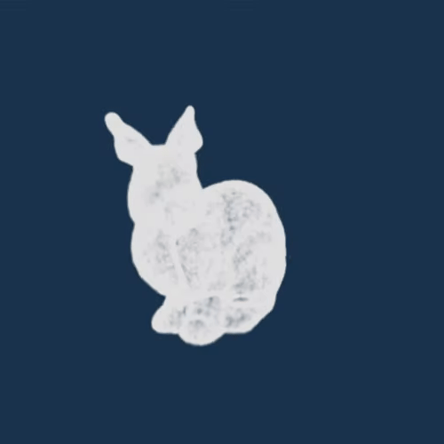

# Minimal 3D Gaussian Splatting Demo

Minimal implementation of 3D Gaussian Splatting renderer. It generates splats from a 3D obj model (the [Stanford's Bunny](https://graphics.stanford.edu/~mdfisher/Data/Meshes/bunny.obj)) and then renders it using WebGPU.



## Clone and run it

[Node.js](https://nodejs.org/) is required to run the npm commands.

```sh
git clone https://github.com/stefanobevilacqua/3d-gaussian-splatting-demo
cd 3d-gaussian-splatting-demo
npm install
npm start
```

Then copy and paste one of the output links to the browser
